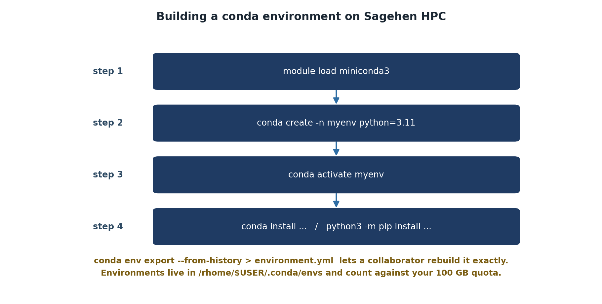

:::::::::::::::::::::::::::::::::::::: questions

- How do I install packages into a conda environment?
- How do I use packages from conda-forge?
- How should I organize my environments?

::::::::::::::::::::::::::::::::::::::::::::::

::::::::::::::::::::::::::::::::::::: objectives

- Install packages with conda install
- Use conda-forge for additional packages
- List installed packages and check versions
- Organize environments by project

::::::::::::::::::::::::::::::::::::::::::::::

## Installing Packages

### Basic installation with conda

Activate your environment and install scientific packages:

```bash
$ conda activate myproject
(myproject) $ conda install numpy scipy matplotlib
```

Conda resolves all dependencies automatically and asks for confirmation:

```
Solving environment: done

The following packages will be installed:
  numpy        scipy        matplotlib    ... (and dependencies)

Proceed? [y/N] y
```

### Checking installed packages

List what's in your environment:

```bash
(myproject) $ conda list
```

Output shows all packages and versions:

```
# packages in environment at /rhome/<myusername>/.conda/envs/myproject:
#
# Name                    Version                   Build  Channel
numpy                      1.24.3                   pypi_0    pypi
scipy                      1.10.1                   pypi_0    pypi
matplotlib                 3.7.1                   pypi_0    pypi
python                      3.11.8              hdb9e83b_0    defaults
...
```

### Using conda-forge

Some packages are on conda-forge, a community channel with more recent versions:

```bash
(myproject) $ conda install -c conda-forge scikit-learn
```

The `-c conda-forge` flag tells conda to search the conda-forge channel.

{alt='Four steps for building a conda environment: load the miniconda3 module, create the environment with conda create -n myenv python=3.11, activate it with conda activate myenv, then install packages with conda install or python3 -m pip install. A note adds that conda env export --from-history lets a collaborator rebuild it exactly, and that environments live in /rhome/$USER/.conda/envs and count against the 100 GB quota.'}

## Organizing Your Environments

::::::::::::::::::::::::::::::::::::: callout

### One Environment Per Project

Create separate conda environments for different projects. This prevents dependencies from one project breaking another and makes it easy to share environments with collaborators. Each environment should be self-contained and reproducible.

::::::::::::::::::::::::::::::::::::::::::::::

### Why multiple environments?

Create separate environments for different projects:
- **myproject**: Latest packages, requires Python 3.11
- **analysis_2024**: Specific versions for reproducibility
- **legacy**: Old packages for long-running code

This isolates dependencies and prevents conflicts between projects.

## Using Conda Environments in Job Scripts

```bash
#!/bin/bash
#SBATCH --job-name=ml_training
#SBATCH --time=02:00:00
#SBATCH --cpus-per-task=8
#SBATCH --mem=32G

# Load miniconda module
module load miniconda3

# Activate your environment
conda activate myproject

# Run your Python script
python train_model.py
```

### Conda initialization in scripts

Some job systems have issues with `conda activate` in scripts. If activation doesn't work, try:

```bash
#!/bin/bash
#SBATCH --job-name=analysis
#SBATCH --time=01:00:00

source ~/.bashrc
module load miniconda3
source activate myproject
python analysis.py
```

## Practical Example: Research Project Setup

```bash
# Create environment for bioinformatics work
$ conda create -n bioinfo python=3.10
$ conda activate bioinfo
(bioinfo) $ conda install biopython pandas matplotlib seaborn
(bioinfo) $ conda install -c conda-forge samtools bcftools
```

### Job script using this environment

```bash
#!/bin/bash
#SBATCH --job-name=bioinfo_pipeline
#SBATCH --time=04:00:00
#SBATCH --cpus-per-task=8
#SBATCH --mem=32G
#SBATCH --array=1-10

module load miniconda3
conda activate bioinfo

python pipeline.py --sample sample_$SLURM_ARRAY_TASK_ID
```

::::::::::::::::::::::::::::::::::::: challenge

### Challenge 1: Install Packages and List

1. Activate the data_sci environment from the previous episode (or create a new one)
2. Install numpy, scipy, and pandas
3. List the installed packages
4. Check the version of numpy

```bash
$ conda activate data_sci
(data_sci) $ conda install numpy scipy pandas
(data_sci) $ conda list
(data_sci) $ python -c "import numpy; print(numpy.__version__)"
```

::::::::::::::: solution

## Solution

After installation, `conda list` shows:
```
numpy        1.24.x
scipy        1.10.x
pandas       2.0.x
(and dependencies)
```

The `python -c` command prints the exact numpy version. All packages are isolated inside the data_sci environment and won't affect other environments.

:::::::::::::::::::::::::::

::::::::::::::::::::::::::::::::::::::::::::::

::::::::::::::::::::::::::::::::::::: keypoints

- Install packages with `conda install package1 package2`
- Use `conda list` to see what's installed and check versions
- Use `-c conda-forge` for packages on the conda-forge channel
- Create one environment per project to prevent dependency conflicts
- Always load miniconda3 and activate your environment in job scripts

::::::::::::::::::::::::::::::::::::::::::::::

<!-- highlight <labname>/<myusername> placeholders in code blocks; remove if the varnish theme handles this natively -->
<script>(function(){var CSS='.sh-placeholder{color:#c2410c;font-weight:700}[data-bs-theme="dark"] .sh-placeholder,html.dark .sh-placeholder{color:#fdba74}@media (prefers-color-scheme: dark){[data-bs-theme="auto"] .sh-placeholder{color:#fdba74}}';var RX=/<labname>|<myusername>/g;function firstMatch(el){var w=document.createTreeWalker(el,NodeFilter.SHOW_TEXT,null),nodes=[],full='';while(w.nextNode()){nodes.push({n:w.currentNode,s:full.length});full+=w.currentNode.nodeValue;}RX.lastIndex=0;var m;while((m=RX.exec(full))){var s=m.index,e=s+m[0].length,inSpan=false,parts=[];for(var j=0;j<nodes.length;j++){var ns=nodes[j].s,ne=ns+nodes[j].n.nodeValue.length;if(ne<=s||ns>=e)continue;parts.push({node:nodes[j].n,a:Math.max(s-ns,0),b:Math.min(e-ns,nodes[j].n.nodeValue.length)});var p=nodes[j].n.parentNode;while(p&&p!==el){if(p.classList&&p.classList.contains('sh-placeholder')){inSpan=true;break;}p=p.parentNode;}}if(!inSpan&&parts.length)return parts;}return null;}function wrapParts(parts){for(var i=parts.length-1;i>=0;i--){var t=parts[i].node,txt=t.nodeValue,a=parts[i].a,b=parts[i].b;var span=document.createElement('span');span.className='sh-placeholder';span.textContent=txt.slice(a,b);var f=document.createDocumentFragment();if(a>0)f.appendChild(document.createTextNode(txt.slice(0,a)));f.appendChild(span);if(b<txt.length)f.appendChild(document.createTextNode(txt.slice(b)));t.parentNode.replaceChild(f,t);}}function run(){var st=document.createElement('style');st.textContent=CSS;document.head.appendChild(st);document.querySelectorAll('pre,code').forEach(function(el){var guard=0,parts;while((parts=firstMatch(el))&&guard++<500){wrapParts(parts);}});}if(document.readyState==='loading'){document.addEventListener('DOMContentLoaded',run);}else{run();}})();</script>
