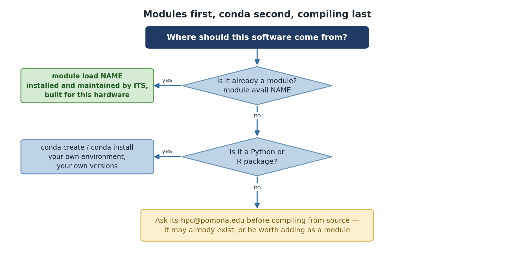

:::::::::::::::::::::::::::::::::::::: questions

- How do I find specific software on Sagehen HPC?
- How do I load and unload modules?
- How do I learn what a module does before loading it?
- What if I need software that isn't available?

::::::::::::::::::::::::::::::::::::::::::::::

::::::::::::::::::::::::::::::::::::: objectives

- Use `module avail` with search patterns to find software
- Load and unload modules with `module load` and `module unload`
- Use `module help` and `module show` to inspect modules
- Know what to do if software isn't available

::::::::::::::::::::::::::::::::::::::::::::::

## Searching for Software

On a cluster with hundreds of modules, finding specific software efficiently is essential.

### Built-in filtering

Lmod can filter the listing itself -- pass a search string to `module avail`:

```bash
$ module avail r
```

The match is a **substring match against the whole module name and version**,
so a single letter matches far too much -- on Sagehen this returns not just
`r/4.5.1` but also `ansys/2023r1`, `apptainer`, `fmriprep`, `rstudio-server`,
`rust`, `trimmomatic`, and dozens more, all because they contain an "r"
somewhere. Use a longer, more specific string:

```bash
$ module avail rstudio
$ module avail conda
$ module avail gaussian
```

`module avail conda` is a good example of why searching matters: it finds both
`anaconda3` and `miniconda3`. There is **no standalone `python` module on
Sagehen** -- searching for `python` finds nothing, because Python is provided
*inside* the conda distributions. When a direct name search comes up empty,
think about what the software might ship inside.

### Deeper searches: `spider` and `keyword`

```bash
$ module spider gaussian     # every version of a module, plus how to load it
$ module keyword chemistry   # searches module descriptions, not just names
```

`module spider` knows about every module and version on the system, and
`module keyword` searches the descriptive text -- useful when you don't know
the package's exact name.

:::::::::::::::::::::::::::::::::::::::::  callout

{alt='A decision tree asking where software should come from. If module avail NAME finds it, use module load NAME, since it is installed and maintained by ITS and built for this hardware. If not, and it is a Python or R package, create your own conda environment. Otherwise, contact its-hpc@pomona.edu before compiling from source, because it may already exist or be worth adding as a module.'}

## Why not just pipe to `grep`?

You'll see `module avail -t | grep name` suggested online, but on Sagehen it
returns nothing: Lmod prints the listing to **standard error** rather than
standard output, and this Lmod version treats a trailing `-t` as a *search
pattern* rather than a flag (hence the confusing
`No module(s) or extension(s) found!`). If you want a grep pipeline, the
options must come *before* the subcommand and stderr must be redirected:

```bash
$ module -t avail 2>&1 | grep -i conda
```

The built-in filters above are simpler and always work -- prefer them.

::::::::::::::::::::::::::::::::::::::::::::::::::

## Loading and Unloading Modules

### Your first module load

```bash
$ module load miniconda3
```

Now check what modules you have loaded:

```bash
$ module list
Currently Loaded Modules:
  1) miniconda3/py313_26.3.2-2
```

To see what this module actually changed:

```bash
$ which python
/opt/.../miniconda3/py313_26.3.2-2/bin/python
```

### Unloading modules

When you're done with software, unload it:

```bash
$ module unload miniconda3
$ which python
/usr/bin/python
```

`python` now refers to the system Python (if it exists) or isn't available.

::::::::::::::::::::::::::::::::::::: callout

### Key Commands Summary

| Command | Purpose |
|---------|---------|
| `module avail` | List all available modules |
| `module load <name>` | Load a module |
| `module list` | Show currently loaded modules |
| `module unload <name>` | Unload a module |
| `which <program>` | Show the full path to a program |

::::::::::::::::::::::::::::::::::::::::::::::

## Learning What a Module Does

::::::::::::::::::::::::::::::::::::: callout

### Check Before You Load

**Always use `module help` before loading an unfamiliar module.** This prevents surprises and shows you what dependencies will be automatically loaded.

::::::::::::::::::::::::::::::::::::::::::::::

### Using `module help`

```bash
$ module help r
```

This prints whatever help text the module's packager provided -- typically a
short description of the software, the version, and any usage notes. The
amount of detail varies from module to module.

### Understanding module dependencies

Some modules automatically load other modules they depend on (for example, an
MPI library or a maths library). When that happens, `module list` after a
single `module load` will show *more than one* loaded module. That is normal --
unloading the module you asked for also removes what it pulled in.

### Using `module show`

To see exactly what a module does to your environment:

```bash
$ module show r/4.5.1
```

Output (simplified):
```
prepend_path("PATH","/opt/.../r/4.5.1/bin")
setenv("R_HOME","/opt/.../r/4.5.1")
```

The `prepend_path` line is the heart of it: loading the module puts that
version's `bin` directory at the front of your `PATH`.

## When Software Isn't Available

If you can't find the software you need:

1. **Double-check your search** with `module avail name` and `module spider name`
2. **Check the Sagehen documentation** for software inventory
3. **Request installation** by emailing its-hpc@pomona.edu with:
   - Software name and version
   - Research purpose
   - License information (open-source, commercial, etc.)
   - Links to documentation

::::::::::::::::::::::::::::::::::::: challenge

### Challenge 1: Load, Check, and Unload

1. Load the `go` module (the default version)
2. Use `module list` to confirm it's loaded
3. Use `which go` to find its location
4. Unload it
5. Try `which go` again; notice the difference

```bash
$ module load go
$ module list
$ which go
$ module unload go
$ which go
```

::::::::::::::: solution

## Solution

```bash
$ module load go
$ module list
Currently Loaded Modules:
  1) go/1.23.1

$ which go
/opt/.../go/1.23.1/bin/go

$ module unload go
$ which go
/usr/bin/which: no go in (...)
```

The key insight: after unloading, the command is gone from your `PATH` -- you
fall back to a system-wide copy if one exists, or to nothing at all.

:::::::::::::::::::::::::::

::::::::::::::::::::::::::::::::::::::::::::::

::::::::::::::::::::::::::::::::::::: challenge

### Challenge 2: Understand Module Dependencies

1. Check which modules are currently loaded
2. Load the R module
3. Check again: what was automatically loaded?
4. Unload only R (not its dependencies)

```bash
$ module list
$ module load r
$ module list
$ module unload r
$ module list
```

::::::::::::::: solution

## Solution

After `module load r`:
```
Currently Loaded Modules:
  1) r/4.5.1
```

After `module unload r`:
```
No modules loaded
```

If a module pulls in dependencies when it loads, those dependencies can remain
loaded after you unload it -- Lmod treats them cautiously because other loaded
modules might also rely on them. If `module list` still shows leftovers you
don't need, unload them explicitly, or use `module purge` to clear everything.

:::::::::::::::::::::::::::

::::::::::::::::::::::::::::::::::::::::::::::

::::::::::::::::::::::::::::::::::::: keypoints

- Use `module avail` with search terms or `grep` to find software
- `module load` activates software; `module unload` deactivates it
- Use `module help` to understand what a module does before loading
- Use `module show` to see exact environment modifications
- Modules can automatically load prerequisites
- If software isn't available, contact its-hpc@pomona.edu to request it

::::::::::::::::::::::::::::::::::::::::::::::
